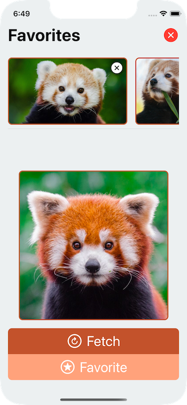

# MVCS: A Simple, Familiar, Yet Powerful Architecture for building SwiftUI Apps

  

## Welcome to a demo of the Model View Controller Store architecture. If you'd like to familiarize yourself with Model View Controller Store you can read about the philosophy, along with a very technical walkthrough [in this post](https://build.ms/2022/06/22/model-view-controller-store/).

SwiftUI has never been granted a blessed architecture by Apple, and many developers have spent countless hours filling the gaps with their own ideas. The most common approach is to take the [MVVM](https://www.objc.io/issues/13-architecture/mvvm/) pattern and translate it to the needs of SwiftUI, which works well but has gaps exposed given SwiftUI's View-centric nature. Others have taken the path of integrating well thought out and powerful libraries such as [The Composable Architecture](https://github.com/pointfreeco/swift-composable-architecture) to have the tools to reason about your entire application, but come with a very high learning curve. 

Model View Controller Store is a rethinking of an architecture familiar to iOS developers [MVC](https://developer.apple.com/library/archive/documentation/General/Conceptual/DevPedia-CocoaCore/MVC.html), for SwiftUI. You can build apps across many platforms using this pattern, in fact the C from MVCS is inspired by Rails [Controllers](https://guides.rubyonrails.org/getting_started.html) rather than [ViewControllers](https://developer.apple.com/documentation/uikit/view_controllers), but in this demo we'll focus on SwiftUI. The Model and View require no changes to your mental model when you think about a Model or View in a SwiftUI app, but what's new is the concept of a `Store`. You can think the `Store` as your storage for your model objects, in SwiftUI this would be your [single source of truth](https://www.raywenderlich.com/11781349-understanding-data-flow-in-swiftui). The combination of MVC and a Store bound together by a simple API allows a developer to give their app a straightforward and well-defined data architecture, with no learning curve, to create an app that's incredibly easy to reason about.

The best way to explain Model View Controller Store is to show you what it is. The idea is so small that I'm convinced you can look at the code in this repo and know how it works almost immediately, there's actually very little to learn. Model View Controller Store doesn't require you to change your apps, and this demo app is powered by [Boutique](https://www.github.com/mergesort/Boutique), a library I've developed to provide a batteries-included `Store`. It requires no tricks to use, does *no behind the scenes magic*, and doesn't resort to shenanigans like runtime hacking to achieve a great developer experience. Boutique's Store is a dual-layered memory and disk cache which ***lets you build apps that update in real time with full offline storage with three lines of code and an incredibly simple API***. That may sound a bit fancy but all it means is that when you save an object into the `Store`, it also saves that object to disk. This persistence is powered under the hood by [Bodega](https://github.com/mergesort/Bodega), an actor-based library I've developed for saving data or Codable objects to disk.

## This repo is primarily oriented to sharing the Model View Controller Store demo code, if you'd like to learn more about how Model View Controller Store, Boutique, and Bodega work, please read the walkthrough [in this post](https://build.ms/2022/06/22/model-view-controller-store/). And if you think this sounds too good to be true I recommend you play with the app yourself and see how simple it really is. 

<h3 align="center">
  Plus don't you want to look at some cute red pandas?
</h3>

https://user-images.githubusercontent.com/716513/174133310-239d7da7-8a0d-48e6-a909-c9a121078f74.mov

> **Note**
> While this demo app stores images in Boutique, storing images or other binary data in Boutique is not recommended. The reason for this is that storing images in Boutique can balloon up your app's memory, so the same way you wouldn't put images into a database you should avoid storing images in Boutique.
> 
>  This was something I only considered after releasing Boutique, and this demo project is still great for demonstrating what Boutique can do, but if you're storing images wouldn't scale to storing the thousands of objects Boutique can handle otherwise. I'm working on an example wtihout images to make sure it's clearer to not use Boutique as an image cache, but I ask folks be patient as I've been overwhelmed with tons of [really positive] feedback. With that said, [Bodega](https://github.com/mergesort/Bodega) is a great way to store binary data to disk, and I would highly recommend it for downloading and storing images.
