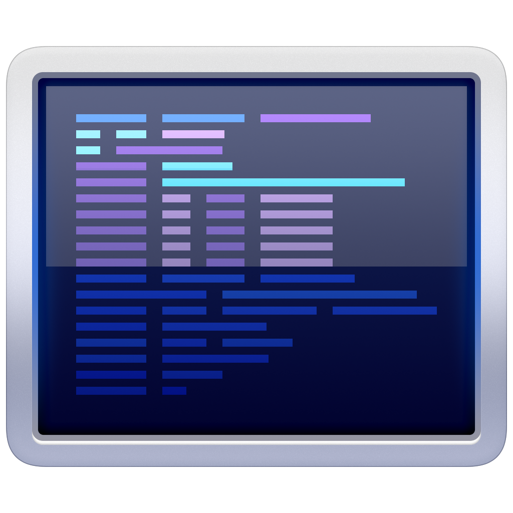
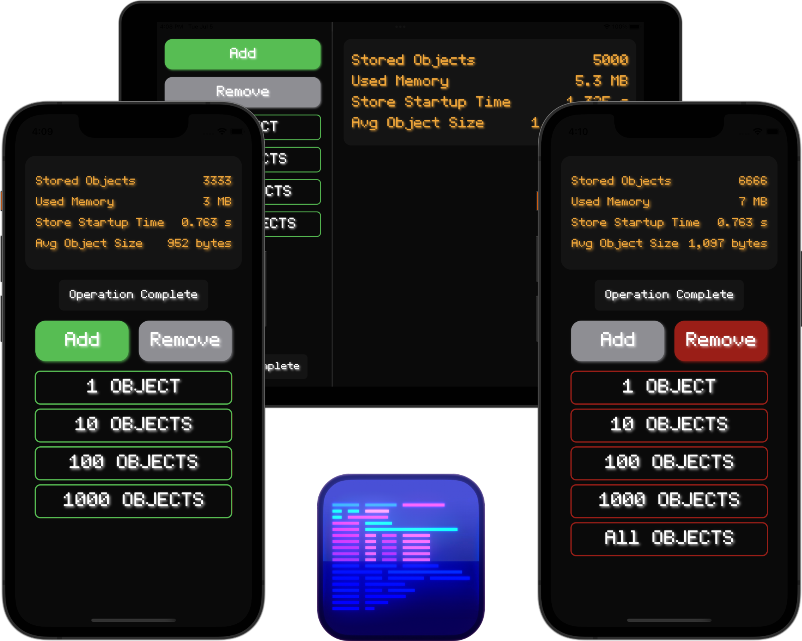

  

Thank you so much [@Sandor](https://dribbble.com/sandor) for the icon, if you think this looks neat as hell like I do, you should commission some of him for some icon work! And thank you [@joeyabanks](https://twitter.com/joeyabanks) for helping me turn it into an app icon.

---

As I was building Boutique it became apparent to me that I needed a way to see the effects of changes I was making in a more real-world manner than using unit tests to measure performance changes. This performance profiler app helps measure those changes and allows me to see the outcome of any changes I make, and pinpoint performance hotspots. It also allows you the user, anyone who's interested in using Boutique, to see what kind of performance they can expect in their apps.

It also looks pretty dope, so I hope you find this app useful. The design is a twist on a terminal emulator, because when I think performance needs I think fun classic hardware.

### About me

Hi, I'm [Joe](http://fabisevi.ch) everywhere on the web, but especially on [Twitter](https://twitter.com/mergesort).

### License

See the [license](../LICENSE) for more information about how you can use Boutique.

### Sponsorship

Boutique is a labor of love to help developers build better apps, making it easier for you to unlock your creativity and make something amazing for your yourself and your users. If you find Boutique valuable I would really appreciate it if you'd consider helping [sponsor my open source work](https://github.com/sponsors/mergesort), so I can continue to work on projects like Boutique to help developers like yourself.
